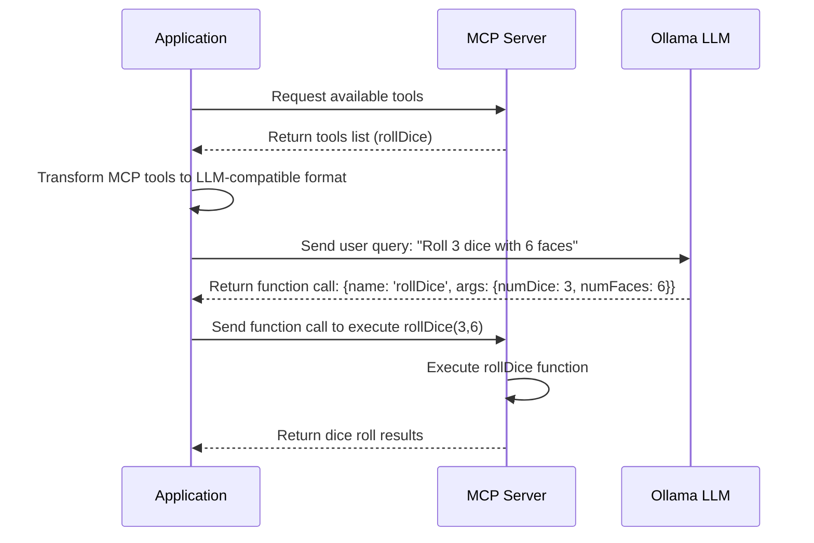
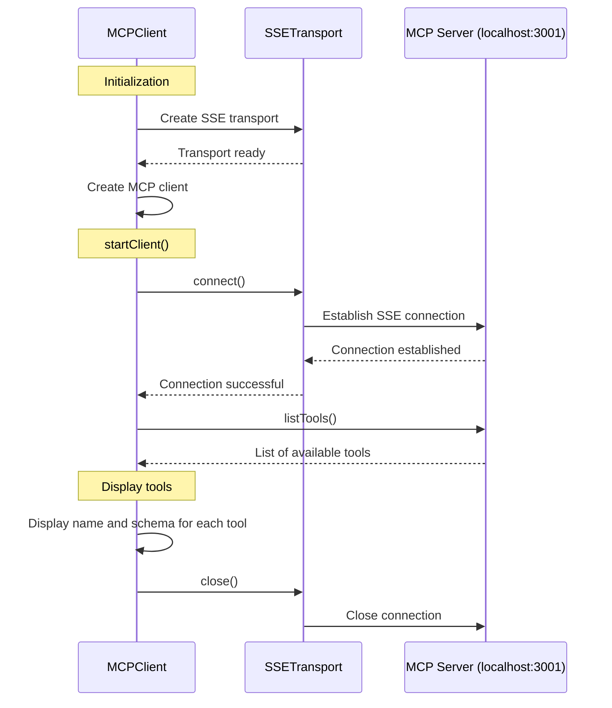
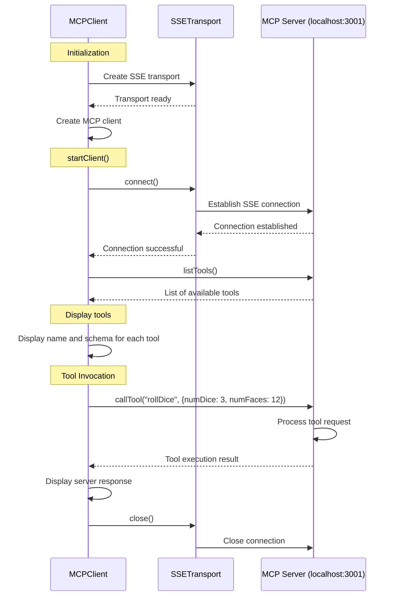
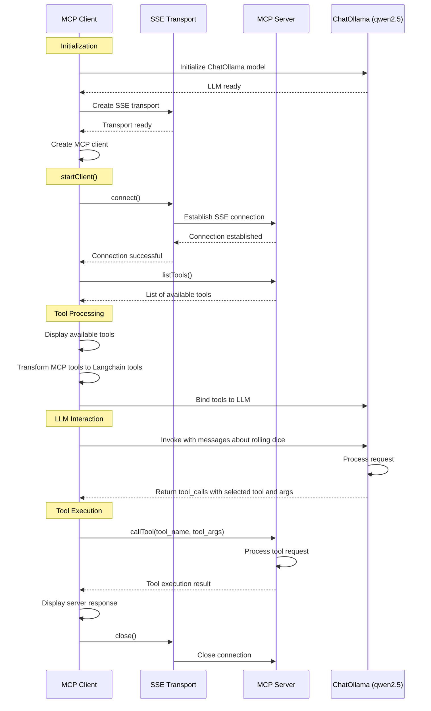

# Utiliser un serveur MCP SSE avec LangchainJS et Ollama

<!-- TODO: intro: l'objectif de cette article est de faire lancer des dés à un LLM en lui demandant de le faire en langage naturel -->

Pour rappel:

- **[MCP](https://www.anthropic.com/news/model-context-protocol)**, pour Model Context Protocol, est un standard ouvert développé par **[Anthropic](https://www.anthropic.com/)** qui permet de connecter les assistants IA aux systèmes où "vivent les données" (référentiels de contenu, outils professionnels et environnements de développement). Cette technologie vise à remplacer les intégrations fragmentées par un protocole universel, permettant aux modèles IA d'accéder plus facilement aux données pertinentes pour produire des réponses de meilleure qualité.

> Si vous souhaitez lire plus de choses sur MCP j'ai aussi écrit deux blog posts:
> - [Understanding the Model Context Protocol](https://k33g.hashnode.dev/understanding-the-model-context-protocol-mcp)
> - [WASImancer, an MCP server with SSE transport, powered by WebAssembly](https://k33g.hashnode.dev/wasimancer-an-mcp-server-with-sse-transport-powered-by-webassembly)

Pour ce blog post, nous utiliserons **[WASImancer](https://github.com/sea-monkeys/WASImancer)**, qui est un serveur MCP que j'ai développé pour mes propres besoins. **WASImancer** suit la **spécification** MCP, il vous sera donc très facile de réutiliser le code source de cet article avec d'autre serveurs MCP. La spécificité de **WASImancer** est de fonctionner à base de **plugins développés en WebAssembly** à l'aide du fantastique projet **[Extism](https://extism.org/)**. La configuration et les données sont définies à l'aide de fichier yaml.

<!-- TODO: Rappel WebAssembly et Extism -->

## Préparation du serveur MCP

Le serveur MCP a besoin d'une structure de projet comme celle-ci:

```bash
.
mcp-server
├── compose.yml
├── plugins
│   ├── plugins.yml
│   └── roll-dice
│       └── wasimancer-plugin-roll-dice.wasm
├── prompts
│   └── prompts.yml
└── resources
    └── resources.yml
```

Le serveur est disponible ici [https://github.com/ollama-tlms-langchainjs/04-mcp-sse-client/mcp-server](https://github.com/ollama-tlms-langchainjs/04-mcp-sse-client/mcp-server). 

L'objectif de ce serveur est de proposer plusieurs services à votre application d'IA générative:

- Faire des lancers de dés avec l'outil **"rollDice"**. L'outil en question est un plugin WebAssembly qui sera exécuté à la demande par le serveur MCP. Le plugin **"rollDice"** est déjà compilé (`wasimancer-plugin-roll-dice.wasm` - le code du plugin est disponible ainsi que les instructions nécessaires pour le recompiler).
- Fournir des ressources texte, comme des instruction système pour votre LLM.
- Proposer des templates de prompt pour vous aider à construire les prompts à destination de votre LLM.

### Configuration

La configuration du serveur se fait par le biais de trois fichiers yaml:
- `plugins/plugins.yml`
- `resources/resources.yml`
- `prompts/prompts.yml`

Voyons leurs contenus respectifs:

#### `plugins.yml`

Ce fichier définit où trouver le plugin à exécuter, et fournit les informations qui sont nécessaires pour l'utiliser, comme ici les arguments `numFaces` et `numDice` de type `number` de la fonction `rollDice`:
```yaml
plugins:

  - name: roll dice
    path: ./roll-dice/wasimancer-plugin-roll-dice.wasm
    version: 1.0.0
    description: roll dice
    functions:
      - displayName: rollDice
        function: rollDice
        arguments:
          - name: numFaces
            type: number
            description: number of faces on the dice
          - name: numDice
            type: number
            description: number of dice to roll
        description: a function to roll dice
```

Comment vais-je utiliser ceci:

1. Avec mon application, lorsque "j'interrogerais" le serveur MCP, il sera capable de me "donner" la liste des outils qu'il possède (dans notre cas, un seul).
2. Je devrais transformer cette liste en une autre liste avec un format compréhensible par Ollama (et le LLM), qui ne sera ni plus ni moins qu'une liste de **"tools"** permettant au LLM de faire du **"function calling"**, et donc de reconnaitre une phrase telle que celle-ci: ***"Jette 3 dés à 6 faces"*** et de répondre par `{ name: 'rollDice', args: { numDice: 3, numFaces: 6 } }`.
3. Ensuite l'application enverra ces informations au serveur MCP
4. Le serveur MCP à partir de ces informations, exécutera la fonction `rollDice(3,6)` et renverra le résultat à l'application.



> ✋ Je vous engage fortement à lire le blog post précédent sur l'utilisation des **"tools"** avec Langchain.js: [Using "tools" support (or function calling) with LangchainJS and Ollama](https://k33g.hashnode.dev/using-tools-support-or-function-calling-with-langchainjs-and-ollama)

#### `resources.yml`

Ce fichier propose des ressources texte qui seront accessibles pour utilisation par l'application d'IA générative:
```yaml
resources:
  static:
    - name: llm-instructions
      uri: llm://instructions
      contents:
        - text: You are a useful AI agent. You can help users to roll dice.
```

Je pourrais me servir de cette ressource pour définir les instructions pour le LLM à envoyer vis Ollama.

#### `prompts.yml`

Le fichier des prompts propose des templates de prompts, et spécifie la ou les variables à interpoler pour construire le prompt:
```yaml
prompts:
  predefined:
    - name: roll-dice
      arguments:
        - name: numFaces
          type: string
        - name: numDice
          type: string
      messages:
        - text: 🎲 Rolling ${numDice} dice(s) with ${numFaces} faces
          role: user

```

> - Par exemple, pour le prompt `roll-dice`, si la valeur de la variable `numFaces` est `6` et la valeur de la variables `numDice` est `3`, le serveur renverra un prompt complété avec cette valeur: `🎲 Rolling 3 dice(s) with 6 faces`
> - Vous pouvez remarquer que vous devez préciser le `role` du message, ici `user` (vous avez le choix entre `user` et `assistant`).
> - le type de la variable est toujours `string` même avec des nombres (on fait de l'interpolation de chaines de caractères).

### Démarrer le serveur MCP

Le serveur **WASImancer** existe aussi sous la forme d'une image Docker (vous pouvez lire le code du [Dockerfile](https://github.com/sea-monkeys/WASImancer/blob/main/Dockerfile)), il est donc très facile de le démarrer avec Docker Compose. Vous trouverez dans le dossier `server` le fichier `compose.yml` suivant:

```yaml
services:  
  wasimancer-server:
    image: k33g/wasimancer:0.0.1
    environment:
      - HTTP_PORT=3001
      - PLUGINS_PATH=./plugins
      - PLUGINS_DEFINITION_FILE=plugins.yml
      - RESOURCES_PATH=./resources
      - RESOURCES_DEFINITION_FILE=resources.yml
      - PROMPTS_PATH=./prompts
      - PROMPTS_DEFINITION_FILE=prompts.yml
    ports:
      - 3001:3001
    volumes:
      - ./resources:/app/resources
      - ./plugins:/app/plugins
      - ./prompts:/app/prompts
```

Donc pour démarrer le serveur MCP, utilisez simplement la commande suivante:

```bash
docker compose up
```

Maintenant que le serveur est démarré, voyons comment utiliser **LangchainJS** et le [SDK MCP Typescript](https://github.com/modelcontextprotocol/typescript-sdk) officiel, pour utiliser les services MCP dans une application d'IA générative en JavaScript.

## Initialiser l'application

Pour initialiser notre nouvelle application d'IA générative, commençons par créer dans un répertoire, un fichier `package.json` pour installer les dépendances. Ce fichier contiendra le contenu suivant:

```json
{
    "name": "roll-dice",
    "version": "1.0.0",
    "description": "",
    "main": "index.js",

    "type": "module",
    "dependencies": {
      "@langchain/ollama": "^0.2.0",
      "dotenv": "^16.4.7",
      "langchain": "^0.3.15",
      "@modelcontextprotocol/sdk": "^1.5.0",
      "prompts": "^2.4.2",
      "zod": "^3.24.1"
    }
}
```

Pour installer les dépendances, tapez la commande suivante:

```bash
npm install
```

Et ensuite, nous allons commencer par voir comment exécuter le "tool MCP" `rollDice`. Créez donc un fichier `01-mcp-tools.js` dans votre répertoire de travail.

## Utilisation des tools MCP

Dans un premier temps, je souhaite obtenir la liste des **"tools"** disponibles sur le serveur MCP.

### Obtenir la liste des tools MCP présents sur le serveur

Ajoutez le code suivant:
**`01-mcp-tools.js`**:
```javascript
import { Client } from "@modelcontextprotocol/sdk/client/index.js";
import { SSEClientTransport } from "@modelcontextprotocol/sdk/client/sse.js";

// Set up the SSE client transport
const transport = new SSEClientTransport(new URL("http://localhost:3001/sse"));

// Create the MCP Client
const mcpClient = new Client(
  {
    name: "mcp-sse-client",
    version: "1.0.0",
  },
  {
    capabilities: {
      prompts: {},
      resources: {},
      tools: {},
      logging: {},
    },
  }
);

// Function to fetch the list of tools
async function fetchTools() {
  try {
    const result = await mcpClient.listTools();
    return result;
  } catch (error) {
    console.error("❌ Error fetching tools:", error);
  }
}

async function startClient() {
  // Connect to the SSE server
  await mcpClient.connect(transport);

  console.log("🔍 Fetching available tools...");
  // Fetch tools
  let mcpTools = await fetchTools();

  console.log("✅ Available Tools:");

  mcpTools.tools.forEach((tool) => {
    console.log("🔨 tool:", tool.name);
    console.log("🔨 schema:", tool.inputSchema);
  });

  // Exit the client
  mcpClient.close();
}

// Start the client
startClient();
```

Ce code implémente un client utilisant le protocole MCP (avec transport SSE) pour se connecter à un serveur, découvrir et lister les outils disponibles. 

**Explications**:

1. **Importation des dépendances**
   - `Client` : La classe principale pour interagir avec le serveur MCP
   - `SSEClientTransport` : Implémentation du transport utilisant les événements SSE

2. **Configuration du transport**
   - Initialisation d'un transport SSE pointant vers `http://localhost:3001/sse`

3. **Création du client MCP**
   - Initialisation avec un nom `mcp-sse-client` et une version `1.0.0`
   - Déclaration des capacités supportées (prompts, resources, tools, logging)

4. **Fonctions principales**
   - `fetchTools()` : Récupère la liste des outils disponibles sur le serveur
   - `startClient()` : Connexion, récupération des outils, affichage, déconnexion

5. **Étapes**
   - Connexion au serveur SSE
   - Requête pour lister les outils disponibles
   - Affichage du nom et du schéma d'entrée de chaque outil
   - Fermeture de la connexion





Si vous exécutez la commande (et assurez vous que vous avez bien démarré le serveur MCP):

```bash
node 01-mcp-tools.js
```

Vous obtiendrez la sortie suivante:

```raw
🔍 Fetching available tools...
✅ Available Tools:
🔨 tool: rollDice
🔨 schema: {
  type: 'object',
  properties: { numFaces: { type: 'number' }, numDice: { type: 'number' } },
  required: [ 'numFaces', 'numDice' ],
  additionalProperties: false,
  '$schema': 'http://json-schema.org/draft-07/schema#'
}
```

Le serveur nous répond qu'il a un seul **"tool"**: `rollDice` avec les arguments `numFaces` et `numDice` de type `number`. Il nous explique aussi que les arguments sont obligatoires.

### Exécuter un "tool" MCP

Maintenant, je souhaite demander au serveur MCP d'exécuter le **"tool"** et de me retourner le résultat. Dupliquez `01-mcp-tools.js` en un fichier `02-run-mcp-tool.js` et modifiez le ficher de la façon suivante:

**`02-run-mcp-tool.js`**:
```javascript
import { Client } from "@modelcontextprotocol/sdk/client/index.js";
import { SSEClientTransport } from "@modelcontextprotocol/sdk/client/sse.js";

// Set up the SSE client transport
const transport = new SSEClientTransport(new URL("http://localhost:3001/sse"));

// Create the MCP Client
const mcpClient = new Client(
  {
    name: "mcp-sse-client",
    version: "1.0.0",
  },
  {
    capabilities: {
      prompts: {},
      resources: {},
      tools: {},
      logging: {},
    },
  }
);

// Function to fetch the list of tools
async function fetchTools() {
  try {
    const result = await mcpClient.listTools();
    return result;
  } catch (error) {
    console.error("❌ Error fetching tools:", error);
  }
}

async function startClient() {
  // Connect to the SSE server
  await mcpClient.connect(transport);

  console.log("🔍 Fetching available tools...");
  // Fetch tools
  let mcpTools = await fetchTools();

  console.log("✅ Available Tools:");

  mcpTools.tools.forEach((tool) => {
    console.log("🔨 tool:", tool.name);
    console.log("🔨 schema:", tool.inputSchema);
  });

  // Call the MCP tool 
  let result = await mcpClient.callTool({
    name: "rollDice",
    arguments: {
      numDice: 3,
      numFaces: 12
    }
  });

  console.log("✅ Server Response:", result);

  // Exit the client
  mcpClient.close();
}

// Start the client
startClient();
```

La modification est simple, je me suis contenté d'ajouter le code ci-dessous, pour faire un lancer de `3` dés à `12` faces:
```javascript
// Call the MCP tool 
let result = await mcpClient.callTool({
name: "rollDice",
arguments: {
    numDice: 3,
    numFaces: 12
}
});

console.log("✅ Server Response:", result);
```

Nous avons donc ajouté l'étape d'exécution dans notre flux:



Si vous exécutez la commande ci dessous (et assurez vous que vous que le serveur MCP est toujours "en marche"):

```bash
node 02-run-mcp-tool.js
```

Vous obtiendrez la sortie suivante:

```raw
🔍 Fetching available tools...
✅ Available Tools:
🔨 tool: rollDice
🔨 schema: {
  type: 'object',
  properties: { numFaces: { type: 'number' }, numDice: { type: 'number' } },
  required: [ 'numFaces', 'numDice' ],
  additionalProperties: false,
  '$schema': 'http://json-schema.org/draft-07/schema#'
}
✅ Server Response: { content: [ { type: 'text', text: '24' } ] }
```

Et bien sûr, si vous relancez le programme, vous noterez que le tirage des dès est alèatoire:

```raw
✅ Server Response: { content: [ { type: 'text', text: '21' } ] }
✅ Server Response: { content: [ { type: 'text', text: '23' } ] }
...
```

Maintenant, voyons comment intégrer Ollama et un LLM dans ces étapes

## Utilisation des tools MCP par un LLM

L'objectif est le suivant: je voudrais pouvoir envoyer la demande suivante au LLM (avec Ollama): ***"Jette 3 dés à 12 faces"*** et que le modèle me réponde avec le résultat obtenu.

Pour cela, 
1. Je vais demander au serveur MCP sa liste d'outils.
2. Je vais transformer cette liste en une liste "compréhensible" par le LLM (nous utiliserons un LLM avec le support des "tools" ou "function calling").
3. Je vais ensuite fournir cette nouvelle liste d'outils au LLM et construire un prompt pour lui "demander" de faire un lancer de dés.
4. Si le LLM comprend à partir de la liste des outils dont il dispose et le prompt, ce qu'il faut faire, il me répondra par le nom de l'outil à exécuter et avec les paramètres nécéssaires à l'exécution de l'outil.
5. je pourrais donc fournir au serveur les informations nécéssaires pour lui déléguer cette exécution (on comprend que le LLM ne sait pas exécuter des commandes, seulement reconnaître des commandes).
6. Et enfin, le serveur MCP me renverra le résultat du lancé de dés.

C'est parti pour le code!

Dupliquez `02-run-mcp-tool.js` en un fichier `03-llm-call-mcp-tool.js` et modifiez le ficher de la façon suivante:

**`03-llm-call-mcp-tool.js`**:
```javascript
import { ChatOllama } from "@langchain/ollama";
import { z } from "zod";
import { tool } from "@langchain/core/tools";

import { Client } from "@modelcontextprotocol/sdk/client/index.js";
import { SSEClientTransport } from "@modelcontextprotocol/sdk/client/sse.js";


const llm = new ChatOllama({
  model: "qwen2.5:0.5b",
  baseUrl: "http://localhost:11434",
  temperature: 0.0,
});


// Set up the SSE client transport
const transport = new SSEClientTransport(new URL("http://localhost:3001/sse"));

// Create the MCP Client
const mcpClient = new Client(
  {
    name: "mcp-sse-client",
    version: "1.0.0",
  },
  {
    capabilities: {
      prompts: {},
      resources: {},
      tools: {},
      logging: {},
    },
  }
);

// Function to fetch the list of tools
async function fetchTools() {
  try {
    const result = await mcpClient.listTools();
    return result;
  } catch (error) {
    console.error("❌ Error fetching tools:", error);
  }
}

async function startClient() {
  // Connect to the SSE server
  await mcpClient.connect(transport);

  console.log("🔍 Fetching available tools...");
  // Fetch tools
  let mcpTools = await fetchTools();

  console.log("✅ Available Tools:");

  mcpTools.tools.forEach((tool) => {
    console.log("🔨 tool:", tool.name);
    console.log("🔨 schema:", tool.inputSchema);
  });

  // Transform MCP Tools list to a tools list understandable by the LLM
  // Use the DynamicTool (Langchain Tools)
  let langchainTools = mcpTools.tools.map((mcpTool) => {
    return tool(null, {
      name: mcpTool.name,
      description: mcpTool.description || "No description provided",
      schema: jsonSchemaToZod(mcpTool.inputSchema),
    });
  });

  // Bind the dynamic tools to the LLM instance
  const llmWithTools = llm.bindTools(langchainTools);

  let messages = [
    ["system", "You are a useful AI agent. You can help users to roll dice."],
    ["user", "🎲 Rolling 3 dice(s) with 12 faces"],
  ];

  // Invoke the LLM with the messages
  let llmOutput = await llmWithTools.invoke(messages);

  // Output the LLM response
  console.log("📦 LLM (response )Output:");
  console.log("llmOutput:", llmOutput.tool_calls[0]);

  // Call the tool via MCP with the LLM response
  let result = await mcpClient.callTool({
    name: llmOutput.tool_calls[0].name,
    arguments: llmOutput.tool_calls[0].args,
  });

  console.log("✅ Server Response:", result);

  // Exit the client
  mcpClient.close();
}

// Start the client
startClient();


/**
 * Convert a JSON Schema object to a Zod schema object.
 * @param {object} jsonSchema - The JSON Schema object to convert
 * @returns {object} - The Zod schema object
 */
function jsonSchemaToZod(jsonSchema) {
  if (!jsonSchema || jsonSchema.type !== "object" || !jsonSchema.properties) {
    return z.object({});
  }

  const shape = {};
  for (const [key, value] of Object.entries(jsonSchema.properties)) {
    let zodType;

    // Map JSON Schema types to Zod types
    switch (value.type) {
      case "string":
        zodType = z.string();
        break;
      case "number":
        zodType = z.number();
        break;
      case "integer":
        zodType = z.number().int();
        break;
      case "boolean":
        zodType = z.boolean();
        break;
      case "array":
        zodType = z.array(jsonSchemaToZod(value.items));
        break;
      case "object":
        zodType = jsonSchemaToZod(value);
        break;
      default:
        zodType = z.any(); // Default case if type is unknown
    }

    // Add optionality if `required` is missing
    if (!jsonSchema.required?.includes(key)) {
      zodType = zodType.optional();
    }

    shape[key] = zodType;
  }

  return z.object(shape);
}
```

### Quelques explications

#### Dépendances

J'ai donc ajouté les dépendances supplêmentaires:
```javascript
import { ChatOllama } from "@langchain/ollama";
import { z } from "zod";
import { tool } from "@langchain/core/tools";
```

#### Client de Chat

Puis j'ai créé un client de chat:
```javascript
const llm = new ChatOllama({
  model: "qwen2.5:0.5b",
  baseUrl: "http://localhost:11434",
  temperature: 0.0,
});
```
> - N'oubliez pas de charger le modèle si vous ne l'avez pas: `ollama pull qwen2.5:0.5b`
> - Lorsque l'on souhaite utiliser le support des tools d'un LLM, la température doit toujours être à `0.0`

#### Transformation de la liste de tools

Ensuite j'ai transformé la liste des tools MCP en liste de `DynamicTool` qui est une structure de LangchainJS, qui permet à LangchainJS de fournir une liste d'outils compréhensible par le LLM:  

```javascript
let langchainTools = mcpTools.tools.map((mcpTool) => {
    return tool(null, {
        name: mcpTool.name,
        description: mcpTool.description || "No description provided",
        schema: jsonSchemaToZod(mcpTool.inputSchema),
    });
});
```

Le format JSON d'un schéma de `mcpTool` diffère du schéma d'un `DynamicTool` qui est au format Zod, j'ai donc créé une fonction de conversion `jsonSchemaToZod` (voir le code de la fonction dans l'exemple complet).

#### Requête pour le LLM

Une fois une liste compatible disponible, je peux la lier au modèle de cette manière:

```javascript
// Bind the dynamic tools to the LLM instance
const llmWithTools = llm.bindTools(langchainTools);
```

Ensuite je crée une liste de messages que j'envoie au modèle pour lui demander de lancer les dés:

```javascript
let messages = [
    ["system", "You are a useful AI agent. You can help users to roll dice."],
    ["user", "🎲 Rolling 3 dice(s) with 12 faces"],
];

// Invoke the LLM with the messages
let llmOutput = await llmWithTools.invoke(messages);

// Output the LLM response
console.log("📦 LLM (response )Output:");
console.log("llmOutput:", llmOutput.tool_calls[0]);
```

Si le modèle reconnaît l'outil, je devrais obtenir une réponse de ce type:

```javascript
{
  name: 'rollDice',
  args: { numDice: 3, numFaces: 12 },
  type: 'tool_call'
}
```

J'ai donc tout ce qu'il me faut pour demander un lancer de dés au serveur MCP et obtenir le résultat:

```javascript
// Call the tool via MCP with the LLM response
let result = await mcpClient.callTool({
    name: llmOutput.tool_calls[0].name,
    arguments: llmOutput.tool_calls[0].args,
});
console.log("✅ Server Response:", result);
```

#### Exécution

Si vous exécutez la commande ci dessous (et assurez vous que vous que le serveur MCP est toujours "en marche"):

```bash
node 03-llm-call-mcp-tool.js
```

Vous obtiendrez une sortie de ce type:

```raw
🔍 Fetching available tools...
✅ Available Tools:
🔨 tool: rollDice
🔨 schema: {
  type: 'object',
  properties: { numFaces: { type: 'number' }, numDice: { type: 'number' } },
  required: [ 'numFaces', 'numDice' ],
  additionalProperties: false,
  '$schema': 'http://json-schema.org/draft-07/schema#'
}
📦 LLM (response )Output:
llmOutput: {
  name: 'rollDice',
  args: { numDice: 3, numFaces: 12 },
  id: '9cf327eb-83d5-429e-8bfb-cf9d3be477c2',
  type: 'tool_call'
}
✅ Server Response: { content: [ { type: 'text', text: '23' } ] }
```

Donc vous pouvez vérifier que le LLM a bien été capable de comprendre la demande et de fournir les information adéquates pour demander au serveur MCP l'exécution de l'outil `rollDice`

Voici donc notre diagramme de flux mis à jour:



Maintenant que nosu avons une première compréhension de l'intérêt de coupler un serveur MCP avec un LLM (et Ollama), voyons voir comment nous pouvons y intégrer le principe des **ressources MCP** et des **templates de prompts MCP**.

## Les ressources


## Les templates de prompts