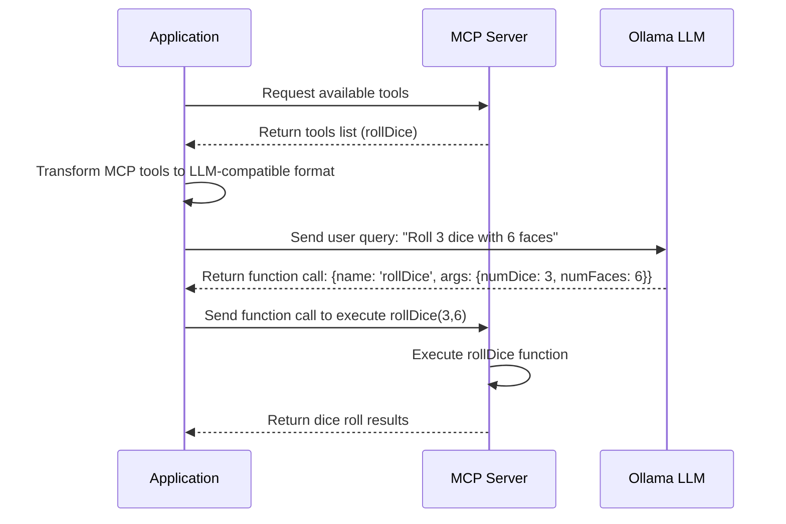
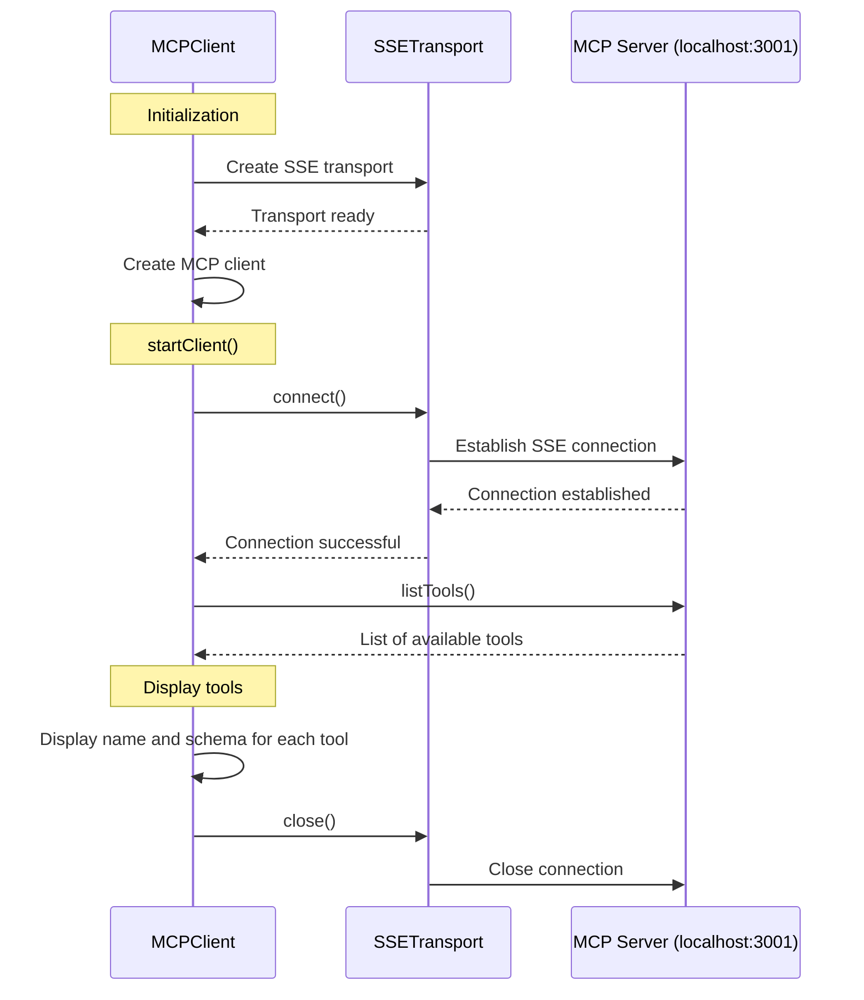
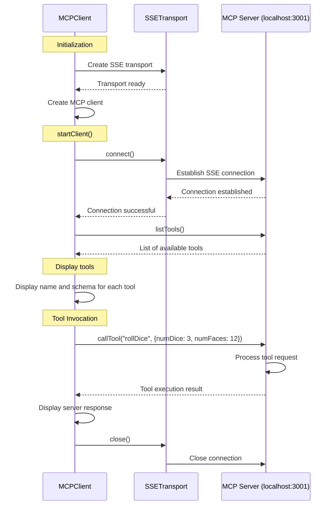
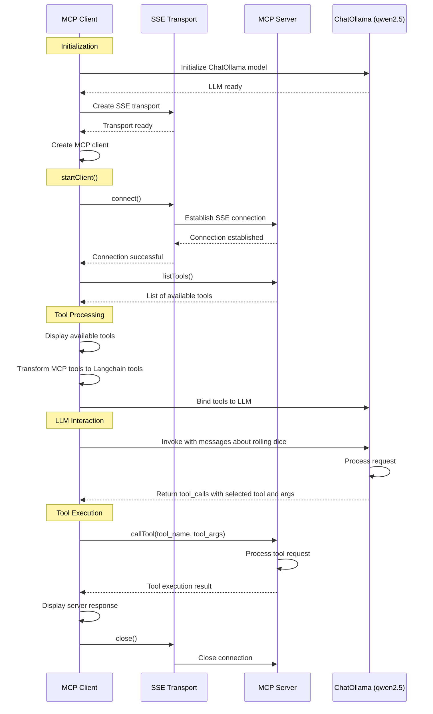
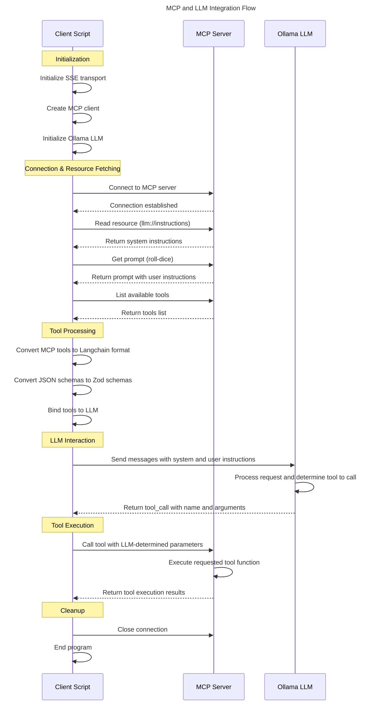

# Using an MCP SSE Server with LangchainJS and Ollama

The goal of this article is to explain how to make an LLM roll dice by asking it to do so in natural language, using the MCP (Model Context Protocol), an LLM, Ollama, and finally using LangchainJS to orchestrate it all.

As a reminder:

- **[MCP](https://www.anthropic.com/news/model-context-protocol)**, or Model Context Protocol, is an open standard developed by **[Anthropic](https://www.anthropic.com/)** that connects AI assistants to systems where "data lives" (content repositories, professional tools, and development environments). This technology aims to replace fragmented integrations with a universal protocol, allowing AI models to more easily access relevant data to produce better quality responses.

> If you'd like to read more about MCP, I've also written two blog posts:
> - [Understanding the Model Context Protocol](https://k33g.hashnode.dev/understanding-the-model-context-protocol-mcp)
> - [WASImancer, an MCP server with SSE transport, powered by WebAssembly](https://k33g.hashnode.dev/wasimancer-an-mcp-server-with-sse-transport-powered-by-webassembly)

For this blog post, we'll use **[WASImancer](https://github.com/sea-monkeys/WASImancer)**, which is an MCP server I developed for my own needs. **WASImancer** follows the MCP **specification**, so it will be very easy to reuse the source code from this article with other MCP servers. The specificity of **WASImancer** is that it works with **plugins developed in WebAssembly** using the fantastic **[Extism](https://extism.org/)** project. Configuration and data are defined using yaml files.

## Preparing the MCP Server

The MCP server needs a project structure like this:

```bash
.
mcp-server
├── compose.yml
├── plugins
│   ├── plugins.yml
│   └── roll-dice
│       └── wasimancer-plugin-roll-dice.wasm
├── prompts
│   └── prompts.yml
└── resources
    └── resources.yml
```

The server is available here [https://github.com/ollama-tlms-langchainjs/04-mcp-sse-client/mcp-server](https://github.com/ollama-tlms-langchainjs/04-mcp-sse-client/mcp-server).

The purpose of this server is to offer several services to your generative AI application:

- Roll dice with the **"rollDice"** tool. This tool is a WebAssembly plugin that will be executed on demand by the MCP server. The **"rollDice"** plugin is already compiled (`wasimancer-plugin-roll-dice.wasm` - the plugin code is available as well as the necessary instructions to recompile it).
- Provide text resources, such as system instructions for your LLM.
- Offer prompt templates to help you build prompts for your LLM.

### Configuration

The server configuration is done through three yaml files:
- `plugins/plugins.yml`
- `resources/resources.yml`
- `prompts/prompts.yml`

Let's look at their respective contents:

#### `plugins.yml`

This file defines where to find the plugin to execute, and provides the information necessary to use it, such as the `numFaces` and `numDice` arguments of type `number` for the `rollDice` function:
```yaml
plugins:

  - name: roll dice
    path: ./roll-dice/wasimancer-plugin-roll-dice.wasm
    version: 1.0.0
    description: roll dice
    functions:
      - displayName: rollDice
        function: rollDice
        arguments:
          - name: numFaces
            type: number
            description: number of faces on the dice
          - name: numDice
            type: number
            description: number of dice to roll
        description: a function to roll dice
```

How I'll use this:

1. With my application, when I "query" the MCP server, it will be able to "give" me the list of tools it has (in our case, just one).
2. I'll need to transform this list into another list with a format understandable by Ollama (and the LLM), which will be nothing more than a list of **"tools"** allowing the LLM to do **"function calling"**, and thus recognize a phrase such as this: ***"Roll 3 dice with 6 faces"*** and respond with `{ name: 'rollDice', args: { numDice: 3, numFaces: 6 } }`.
3. Then the application will send this information to the MCP server.
4. The MCP server, based on this information, will execute the `rollDice(3,6)` function and return the result to the application.



> ✋ I strongly encourage you to read the previous blog post on using **"tools"** with Langchain.js: [Using "tools" support (or function calling) with LangchainJS and Ollama](https://k33g.hashnode.dev/using-tools-support-or-function-calling-with-langchainjs-and-ollama)

#### `resources.yml`

This file offers text resources that will be accessible for use by the generative AI application:
```yaml
resources:
  static:
    - name: llm-instructions
      uri: llm://instructions
      contents:
        - text: You are a useful AI agent. You can help users to roll dice.
```

I could use this resource to define the instructions for the LLM to send via Ollama.

#### `prompts.yml`

The prompts file offers prompt templates, and specifies the variable(s) to interpolate to build the prompt:
```yaml
prompts:
  predefined:
    - name: roll-dice
      arguments:
        - name: numFaces
          type: string
        - name: numDice
          type: string
      messages:
        - text: 🎲 Rolling ${numDice} dice(s) with ${numFaces} faces
          role: user

```

> - For example, for the `roll-dice` prompt, if the value of the `numFaces` variable is `6` and the value of the `numDice` variable is `3`, the server will return a prompt completed with this value: `🎲 Rolling 3 dice(s) with 6 faces`
> - You can notice that you need to specify the `role` of the message, here `user` (you have the choice between `user` and `assistant`).
> - the type of the variable is always `string` even with numbers (we're doing string interpolation).

### Starting the MCP Server

The **WASImancer** server also exists as a Docker image (you can read the [Dockerfile](https://github.com/sea-monkeys/WASImancer/blob/main/Dockerfile) code), so it's very easy to start with Docker Compose. You will find in the `server` folder the following `compose.yml` file:

```yaml
services:  
  wasimancer-server:
    image: k33g/wasimancer:0.0.1
    environment:
      - HTTP_PORT=3001
      - PLUGINS_PATH=./plugins
      - PLUGINS_DEFINITION_FILE=plugins.yml
      - RESOURCES_PATH=./resources
      - RESOURCES_DEFINITION_FILE=resources.yml
      - PROMPTS_PATH=./prompts
      - PROMPTS_DEFINITION_FILE=prompts.yml
    ports:
      - 3001:3001
    volumes:
      - ./resources:/app/resources
      - ./plugins:/app/plugins
      - ./prompts:/app/prompts
```

So to start the MCP server, simply use the following command:

```bash
docker compose up
```

Now that the server is started, let's see how to use **LangchainJS** and the official [MCP Typescript SDK](https://github.com/modelcontextprotocol/typescript-sdk) to use MCP services in a JavaScript generative AI application.

## Initialize the Application

To initialize our new generative AI application, let's start by creating a `package.json` file in a directory to install dependencies. This file will contain the following content:

```json
{
    "name": "roll-dice",
    "version": "1.0.0",
    "description": "",
    "main": "index.js",

    "type": "module",
    "dependencies": {
      "@langchain/ollama": "^0.2.0",
      "dotenv": "^16.4.7",
      "langchain": "^0.3.15",
      "@modelcontextprotocol/sdk": "^1.5.0",
      "prompts": "^2.4.2",
      "zod": "^3.24.1"
    }
}
```

To install the dependencies, type the following command:

```bash
npm install
```

And then, let's start by seeing how to execute the "MCP tool" `rollDice`. Create a file `01-mcp-tools.js` in your working directory.

## Using MCP Tools

First, I want to get the list of **"tools"** available on the MCP server.

### Get the List of MCP Tools Present on the Server

Add the following code:
**`01-mcp-tools.js`**:
```javascript
import { Client } from "@modelcontextprotocol/sdk/client/index.js";
import { SSEClientTransport } from "@modelcontextprotocol/sdk/client/sse.js";

// Set up the SSE client transport
const transport = new SSEClientTransport(new URL("http://localhost:3001/sse"));

// Create the MCP Client
const mcpClient = new Client(
  {
    name: "mcp-sse-client",
    version: "1.0.0",
  },
  {
    capabilities: {
      prompts: {},
      resources: {},
      tools: {},
      logging: {},
    },
  }
);

// Function to fetch the list of tools
async function fetchTools() {
  try {
    const result = await mcpClient.listTools();
    return result;
  } catch (error) {
    console.error("❌ Error fetching tools:", error);
  }
}

async function startClient() {
  // Connect to the SSE server
  await mcpClient.connect(transport);

  console.log("🔍 Fetching available tools...");
  // Fetch tools
  let mcpTools = await fetchTools();

  console.log("✅ Available Tools:");

  mcpTools.tools.forEach((tool) => {
    console.log("🔨 tool:", tool.name);
    console.log("🔨 schema:", tool.inputSchema);
  });

  // Exit the client
  mcpClient.close();
}

// Start the client
startClient();
```

This code implements a client using the MCP protocol (with SSE transport) to connect to a server, discover and list the available tools.

**Explanations**:

1. **Importing Dependencies**
   - `Client`: The main class for interacting with the MCP server
   - `SSEClientTransport`: Implementation of transport using SSE events

2. **Transport Configuration**
   - Initialization of an SSE transport pointing to `http://localhost:3001/sse`

3. **Creating the MCP Client**
   - Initialization with a name `mcp-sse-client` and version `1.0.0`
   - Declaration of supported capabilities (prompts, resources, tools, logging)

4. **Main Functions**
   - `fetchTools()`: Retrieves the list of tools available on the server
   - `startClient()`: Connection, tool retrieval, display, disconnection

5. **Steps**
   - Connection to the SSE server
   - Request to list available tools
   - Display of name and input schema for each tool
   - Close the connection





If you run the command (and make sure you have started the MCP server):

```bash
node 01-mcp-tools.js
```

You will get the following output:

```raw
🔍 Fetching available tools...
✅ Available Tools:
🔨 tool: rollDice
🔨 schema: {
  type: 'object',
  properties: { numFaces: { type: 'number' }, numDice: { type: 'number' } },
  required: [ 'numFaces', 'numDice' ],
  additionalProperties: false,
  '$schema': 'http://json-schema.org/draft-07/schema#'
}
```

The server tells us that it has only one **"tool"**: `rollDice` with the arguments `numFaces` and `numDice` of type `number`. It also explains that the arguments are required.

### Execute an MCP "Tool"

Now, I want to ask the MCP server to execute the **"tool"** and return the result to me. Duplicate `01-mcp-tools.js` into a file `02-run-mcp-tool.js` and modify the file as follows:

**`02-run-mcp-tool.js`**:
```javascript
import { Client } from "@modelcontextprotocol/sdk/client/index.js";
import { SSEClientTransport } from "@modelcontextprotocol/sdk/client/sse.js";

// Set up the SSE client transport
const transport = new SSEClientTransport(new URL("http://localhost:3001/sse"));

// Create the MCP Client
const mcpClient = new Client(
  {
    name: "mcp-sse-client",
    version: "1.0.0",
  },
  {
    capabilities: {
      prompts: {},
      resources: {},
      tools: {},
      logging: {},
    },
  }
);

// Function to fetch the list of tools
async function fetchTools() {
  try {
    const result = await mcpClient.listTools();
    return result;
  } catch (error) {
    console.error("❌ Error fetching tools:", error);
  }
}

async function startClient() {
  // Connect to the SSE server
  await mcpClient.connect(transport);

  console.log("🔍 Fetching available tools...");
  // Fetch tools
  let mcpTools = await fetchTools();

  console.log("✅ Available Tools:");

  mcpTools.tools.forEach((tool) => {
    console.log("🔨 tool:", tool.name);
    console.log("🔨 schema:", tool.inputSchema);
  });

  // Call the MCP tool 
  let result = await mcpClient.callTool({
    name: "rollDice",
    arguments: {
      numDice: 3,
      numFaces: 12
    }
  });

  console.log("✅ Server Response:", result);

  // Exit the client
  mcpClient.close();
}

// Start the client
startClient();
```

The modification is simple, I just added the code below, to roll `3` dice with `12` faces:
```javascript
// Call the MCP tool 
let result = await mcpClient.callTool({
name: "rollDice",
arguments: {
    numDice: 3,
    numFaces: 12
}
});

console.log("✅ Server Response:", result);
```

So we've added the execution step to our flow:



If you run the command below (and make sure that the MCP server is still "running"):

```bash
node 02-run-mcp-tool.js
```

You will get the following output:

```raw
🔍 Fetching available tools...
✅ Available Tools:
🔨 tool: rollDice
🔨 schema: {
  type: 'object',
  properties: { numFaces: { type: 'number' }, numDice: { type: 'number' } },
  required: [ 'numFaces', 'numDice' ],
  additionalProperties: false,
  '$schema': 'http://json-schema.org/draft-07/schema#'
}
✅ Server Response: { content: [ { type: 'text', text: '24' } ] }
```

And of course, if you run the program again, you'll notice that the dice roll is random:

```raw
✅ Server Response: { content: [ { type: 'text', text: '21' } ] }
✅ Server Response: { content: [ { type: 'text', text: '23' } ] }
...
```

Now, let's see how to integrate Ollama and an LLM into these steps.

## Using MCP Tools with an LLM

The goal is as follows: I would like to be able to send the following request to the LLM (with Ollama): ***"Roll 3 dice with 12 faces"*** and have the model respond with the obtained result.

To do this:
1. I'll ask the MCP server for its list of tools.
2. I'll transform this list into a list "understandable" by the LLM (we'll use an LLM with support for "tools" or "function calling").
3. I'll then provide this new list of tools to the LLM and build a prompt to "ask" it to roll dice.
4. If the LLM understands from the list of tools at its disposal and the prompt what to do, it will respond with the name of the tool to execute and the parameters necessary for executing the tool.
5. I can then provide the MCP server with the necessary information to delegate this execution (we understand that the LLM doesn't know how to execute commands, only recognize commands).
6. And finally, the MCP server will return the result of the dice roll.

Let's go for the code!

Duplicate `02-run-mcp-tool.js` into a file `03-llm-call-mcp-tool.js` and modify the file as follows:

**`03-llm-call-mcp-tool.js`**:
```javascript
import { ChatOllama } from "@langchain/ollama";
import { z } from "zod";
import { tool } from "@langchain/core/tools";

import { Client } from "@modelcontextprotocol/sdk/client/index.js";
import { SSEClientTransport } from "@modelcontextprotocol/sdk/client/sse.js";


const llm = new ChatOllama({
  model: "qwen2.5:0.5b",
  baseUrl: "http://localhost:11434",
  temperature: 0.0,
});


// Set up the SSE client transport
const transport = new SSEClientTransport(new URL("http://localhost:3001/sse"));

// Create the MCP Client
const mcpClient = new Client(
  {
    name: "mcp-sse-client",
    version: "1.0.0",
  },
  {
    capabilities: {
      prompts: {},
      resources: {},
      tools: {},
      logging: {},
    },
  }
);

// Function to fetch the list of tools
async function fetchTools() {
  try {
    const result = await mcpClient.listTools();
    return result;
  } catch (error) {
    console.error("❌ Error fetching tools:", error);
  }
}

async function startClient() {
  // Connect to the SSE server
  await mcpClient.connect(transport);

  console.log("🔍 Fetching available tools...");
  // Fetch tools
  let mcpTools = await fetchTools();

  console.log("✅ Available Tools:");

  mcpTools.tools.forEach((tool) => {
    console.log("🔨 tool:", tool.name);
    console.log("🔨 schema:", tool.inputSchema);
  });

  // Transform MCP Tools list to a tools list understandable by the LLM
  // Use the DynamicTool (Langchain Tools)
  let langchainTools = mcpTools.tools.map((mcpTool) => {
    return tool(null, {
      name: mcpTool.name,
      description: mcpTool.description || "No description provided",
      schema: jsonSchemaToZod(mcpTool.inputSchema),
    });
  });

  // Bind the dynamic tools to the LLM instance
  const llmWithTools = llm.bindTools(langchainTools);

  let messages = [
    ["system", "You are a useful AI agent. You can help users to roll dice."],
    ["user", "🎲 Rolling 3 dice(s) with 12 faces"],
  ];

  // Invoke the LLM with the messages
  let llmOutput = await llmWithTools.invoke(messages);

  // Output the LLM response
  console.log("📦 LLM (response )Output:");
  console.log("llmOutput:", llmOutput.tool_calls[0]);

  // Call the tool via MCP with the LLM response
  let result = await mcpClient.callTool({
    name: llmOutput.tool_calls[0].name,
    arguments: llmOutput.tool_calls[0].args,
  });

  console.log("✅ Server Response:", result);

  // Exit the client
  mcpClient.close();
}

// Start the client
startClient();


/**
 * Convert a JSON Schema object to a Zod schema object.
 * @param {object} jsonSchema - The JSON Schema object to convert
 * @returns {object} - The Zod schema object
 */
function jsonSchemaToZod(jsonSchema) {
  if (!jsonSchema || jsonSchema.type !== "object" || !jsonSchema.properties) {
    return z.object({});
  }

  const shape = {};
  for (const [key, value] of Object.entries(jsonSchema.properties)) {
    let zodType;

    // Map JSON Schema types to Zod types
    switch (value.type) {
      case "string":
        zodType = z.string();
        break;
      case "number":
        zodType = z.number();
        break;
      case "integer":
        zodType = z.number().int();
        break;
      case "boolean":
        zodType = z.boolean();
        break;
      case "array":
        zodType = z.array(jsonSchemaToZod(value.items));
        break;
      case "object":
        zodType = jsonSchemaToZod(value);
        break;
      default:
        zodType = z.any(); // Default case if type is unknown
    }

    // Add optionality if `required` is missing
    if (!jsonSchema.required?.includes(key)) {
      zodType = zodType.optional();
    }

    shape[key] = zodType;
  }

  return z.object(shape);
}
```

### Some Explanations

#### Dependencies

So I added the additional dependencies:
```javascript
import { ChatOllama } from "@langchain/ollama";
import { z } from "zod";
import { tool } from "@langchain/core/tools";
```

#### Chat Client

Then I created a chat client:
```javascript
const llm = new ChatOllama({
  model: "qwen2.5:0.5b",
  baseUrl: "http://localhost:11434",
  temperature: 0.0,
});
```
> - Don't forget to load the model if you don't have it: `ollama pull qwen2.5:0.5b`
> - When you want to use an LLM's tools support, the temperature should always be `0.0`

#### Transforming the Tools List

Then I transformed the list of MCP tools into a list of `DynamicTool` which is a LangchainJS structure, allowing LangchainJS to provide a list of tools understandable by the LLM:

```javascript
let langchainTools = mcpTools.tools.map((mcpTool) => {
    return tool(null, {
        name: mcpTool.name,
        description: mcpTool.description || "No description provided",
        schema: jsonSchemaToZod(mcpTool.inputSchema),
    });
});
```

The JSON format of an `mcpTool` schema differs from the schema of a `DynamicTool` which is in Zod format, so I created a conversion function `jsonSchemaToZod` (see the function code in the complete example).

#### Request for the LLM

Once a compatible list is available, I can bind it to the model like this:

```javascript
// Bind the dynamic tools to the LLM instance
const llmWithTools = llm.bindTools(langchainTools);
```

Then I create a list of messages that I send to the model to ask it to roll the dice:

```javascript
let messages = [
    ["system", "You are a useful AI agent. You can help users to roll dice."],
    ["user", "🎲 Rolling 3 dice(s) with 12 faces"],
];

// Invoke the LLM with the messages
let llmOutput = await llmWithTools.invoke(messages);

// Output the LLM response
console.log("📦 LLM (response )Output:");
console.log("llmOutput:", llmOutput.tool_calls[0]);
```

If the model recognizes the tool, I should get a response like this:

```javascript
{
  name: 'rollDice',
  args: { numDice: 3, numFaces: 12 },
  type: 'tool_call'
}
```

So I have everything I need to request a dice roll from the MCP server and get the result:

```javascript
// Call the tool via MCP with the LLM response
let result = await mcpClient.callTool({
    name: llmOutput.tool_calls[0].name,
    arguments: llmOutput.tool_calls[0].args,
});
console.log("✅ Server Response:", result);
```

#### Execution

If you run the command below (and make sure that the MCP server is still "running"):

```bash
node 03-llm-call-mcp-tool.js
```

You'll get output like this:

```raw
🔍 Fetching available tools...
✅ Available Tools:
🔨 tool: rollDice
🔨 schema: {
  type: 'object',
  properties: { numFaces: { type: 'number' }, numDice: { type: 'number' } },
  required: [ 'numFaces', 'numDice' ],
  additionalProperties: false,
  '$schema': 'http://json-schema.org/draft-07/schema#'
}
📦 LLM (response )Output:
llmOutput: {
  name: 'rollDice',
  args: { numDice: 3, numFaces: 12 },
  id: '9cf327eb-83d5-429e-8bfb-cf9d3be477c2',
  type: 'tool_call'
}
✅ Server Response: { content: [ { type: 'text', text: '23' } ] }
```

So you can verify that the LLM was indeed able to understand the request and provide the appropriate information to ask the MCP server to execute the `rollDice` tool.

Here is our updated flow diagram:



Now that we have a first understanding of the benefit of coupling an MCP server with an LLM (and Ollama), let's see how we can integrate the concept of **MCP resources** and **MCP prompt templates**.

## Resources

With the official [MCP Typescript SDK](https://github.com/modelcontextprotocol/typescript-sdk), it's very easy to access MCP resources. Create a file `04-mcp-resources.js` with the following source code:

```javascript
import { Client } from "@modelcontextprotocol/sdk/client/index.js";
import { SSEClientTransport } from "@modelcontextprotocol/sdk/client/sse.js";

// Set up the SSE client transport
const transport = new SSEClientTransport(new URL("http://localhost:3001/sse"));

// Create the MCP Client
const mcpClient = new Client(
  {
    name: "mcp-sse-client",
    version: "1.0.0",
  },
  {
    capabilities: {
      prompts: {},
      resources: {},
      tools: {},
      logging: {},
    },
  }
);

async function startClient() {
  // Connect to the SSE server
  await mcpClient.connect(transport);

  // Resources
  const resources = await mcpClient.listResources();
  console.log("📦 Available Resources:", resources);

  const llmInstruction = await mcpClient.readResource({
    uri: "llm://instructions",
  });
  // Resource Content:
  let systemInstructions = llmInstruction.contents[0].text;
  console.log("📝 System Instructions:", systemInstructions);

  // Exit the client
  mcpClient.close();
}

// Start the client
startClient();
```

This code implements a client using the MCP protocol to connect to a server, list and access available resources:

1. **Importing Dependencies**
   - `Client`: The main class for interacting with the MCP server
   - `SSEClientTransport`: Implementation of transport using SSE events

2. **Transport Configuration**
   - Initialization of an SSE transport pointing to `http://localhost:3001/sse`

3. **Creating the MCP Client**
   - Initialization with a name (`mcp-sse-client`) and a version (`1.0.0`)
   - Declaration of supported capabilities (prompts, resources, tools, logging)

4. **Main Function `startClient()`**
   - **Connection**: The client connects to the server via SSE transport
   - ✋ **Listing resources**: Call to `mcpClient.listResources()` to get all available resources
   - ✋ **Reading a resource**: Access to the specific resource `llm://instructions` with `mcpClient.readResource()`
   - **Content extraction**: Retrieving the system instruction text from the resource
   - **Display**: The resource content is displayed in the console
   - **Disconnection**: Proper closing of the connection with `mcpClient.close()`

5. **Starting the Client**
   - The `startClient()` function is called to execute the sequence

If you run the command below (and make sure that the MCP server is still running):

```bash
node 04-mcp-resources.js
```

You will get output like this:

```raw
📦 Available Resources: {
  resources: [ { uri: 'llm://instructions', name: 'llm-instructions' } ]
}
📝 System Instructions: You are a useful AI agent. You can help users to roll dice.
```

So it will be easy to pre-define instructions for our LLM.

## Prompt Templates

Similarly, the [MCP Typescript SDK](https://github.com/modelcontextprotocol/typescript-sdk) provides the necessary tools to use MCP prompt templates. Create a file `05-mcp-prompts.js` with the following source code:

```javascript
import { Client } from "@modelcontextprotocol/sdk/client/index.js";
import { SSEClientTransport } from "@modelcontextprotocol/sdk/client/sse.js";

// Set up the SSE client transport
const transport = new SSEClientTransport(new URL("http://localhost:3001/sse"));

// Create the MCP Client
const mcpClient = new Client(
  {
    name: "mcp-sse-client",
    version: "1.0.0",
  },
  {
    capabilities: {
      prompts: {},
      resources: {},
      tools: {},
      logging: {},
    },
  }
);

async function startClient() {
  // Connect to the SSE server
  await mcpClient.connect(transport);

  // Prompts
  const prompts = await mcpClient.listPrompts();
  console.log("📣 Available Prompts:", JSON.stringify(prompts, null, 2));

  const prompt = await mcpClient.getPrompt({
    name: "roll-dice",
    arguments: { numDice: "3", numFaces: "12" }, // always use strings for arguments
  });

  console.log("🎲 Prompt:", JSON.stringify(prompt, null, 2));
  let role = prompt.messages[0].role;
  let userInstructions = prompt.messages[0].content.text;
  console.log("👤 Role:",role , "📝 Instructions:", userInstructions);

  // Exit the client
  mcpClient.close();
}

// Start the client
startClient();


```

This code implements a client using the MCP protocol to connect to a server, list and access available prompt templates and use them to generate complete prompts from input elements:

1. **Importing Dependencies**
   - `Client`: The main class for interacting with the MCP server
   - `SSEClientTransport`: Implementation of transport using SSE events

2. **Transport Configuration**
   - Initialization of an SSE transport pointing to `http://localhost:3001/sse`

3. **Creating the MCP Client**
   - Initialization with a name (`mcp-sse-client`) and a version (`1.0.0`)
   - Declaration of supported capabilities (prompts, resources, tools, logging)

4. **Main Function `startClient()`**
   - **Connection**: The client connects to the server via SSE transport
   - ✋ **Listing prompts**: Call to `mcpClient.listPrompts()` to get all available prompts
   - **Retrieving a specific prompt**: 
     - ✋ Call to `mcpClient.getPrompt()` with the prompt name (`roll-dice`) 
     - ✋ Passing arguments (`numDice: "3", numFaces: "12"`) as strings
   - **Content extraction**: Retrieving the user instruction text from the first message of the prompt
   - **Display**: The prompt content is displayed in the console
   - **Disconnection**: Proper closing of the connection with `mcpClient.close()`

5. **Starting the Client**
   - The `startClient()` function is called to execute the sequence

If you run the command below (and make sure that the MCP server is still running):

```bash
node 05-mcp-prompts.js
```

You will get output like this:

```raw
📣 Available Prompts: {
  "prompts": [
    {
      "name": "roll-dice",
      "arguments": [
        {
          "name": "numFaces",
          "required": true
        },
        {
          "name": "numDice",
          "required": true
        }
      ]
    }
  ]
}
🎲 Prompt: {
  "messages": [
    {
      "role": "user",
      "content": {
        "type": "text",
        "text": "🎲 Rolling 3 dice(s) with 12 faces"
      }
    }
  ]
}
👤 user 📝 User Instructions: 🎲 Rolling 3 dice(s) with 12 faces
```

Prompt templates allow us to offer "ready-made and structured" prompts.

Now let's see how to orchestrate all these elements in a single application.

## Qwen, Please Roll the Dice

Create a final file `06-all-in-one.js` with the following source code:

```javascript
import { ChatOllama } from "@langchain/ollama";
import { z } from "zod";
import { tool } from "@langchain/core/tools";

import { Client } from "@modelcontextprotocol/sdk/client/index.js";
import { SSEClientTransport } from "@modelcontextprotocol/sdk/client/sse.js";

// Set up the SSE client transport
const transport = new SSEClientTransport(new URL("http://localhost:3001/sse"));

const llm = new ChatOllama({
  model: "qwen2.5:0.5b",
  //baseUrl: "http://host.docker.internal:11434",
  baseUrl: "http://localhost:11434",
  temperature: 0.0,
});

// Create the MCP Client
const mcpClient = new Client(
  {
    name: "mcp-sse-client",
    version: "1.0.0",
  },
  {
    capabilities: {
      prompts: {},
      resources: {},
      tools: {},
      logging: {},
    },
  }
);

// Function to fetch the list of tools
async function fetchTools() {
  try {
    console.log("🔍 Fetching available tools...");
    const result = await mcpClient.listTools();
    return result;
  } catch (error) {
    console.error("❌ Error fetching tools:", error);
  }
}

async function startClient() {
  // Connect to the SSE server
  await mcpClient.connect(transport);

  // Read Resources
  const llmInstruction = await mcpClient.readResource({
    uri: "llm://instructions",
  });
  // Get the Resource Content:
  let systemInstructions = llmInstruction.contents[0].text;

  // Get a prompt by name
  const prompt = await mcpClient.getPrompt({
    name: "roll-dice",
    arguments: { numDice: "3", numFaces: "12" }, // always use strings for arguments
  });
  let userInstructions = prompt.messages[0].content.text;
  let role = prompt.messages[0].role;

  // Fetch MCP tools
  let mcpTools = await fetchTools();

  // Transform MCP Tools list to a tools list understandable by the LLM
  let langchainTools = mcpTools.tools.map((mcpTool) => {
    return tool(null, {
      name: mcpTool.name,
      description: mcpTool.description || "No description provided",
      schema: jsonSchemaToZod(mcpTool.inputSchema),
    });
  });

  // Bind the dynamic tools to the LLM instance
  const llmWithTools = llm.bindTools(langchainTools);

  // Define the messages to send to the LLM
  let messages = [
    ["system", systemInstructions],
    [role, userInstructions],
  ];

  // Invoke the LLM with the messages
  let llmOutput = await llmWithTools.invoke(messages);

  // Output the LLM response
  console.log("📦 LLM Output:", llmOutput.tool_calls[0]);

  // Call the tool via MCP with the LLM response
  let result = await mcpClient.callTool({
    name: llmOutput.tool_calls[0].name,
    arguments: llmOutput.tool_calls[0].args,
  });

  // Output the server response
  console.log("✅ Server Response:", result);

  // Exit the client
  console.log("👋 Closing connection...");
  mcpClient.close();
  console.log("🔌 Disconnected!");
}

// Start the client
startClient();

/**
 * Convert a JSON Schema object to a Zod schema object.
 * @param {object} jsonSchema - The JSON Schema object to convert
 * @returns {object} - The Zod schema object
 */
function jsonSchemaToZod(jsonSchema) {
  if (!jsonSchema || jsonSchema.type !== "object" || !jsonSchema.properties) {
    return z.object({});
  }

  const shape = {};
  for (const [key, value] of Object.entries(jsonSchema.properties)) {
    let zodType;

    // Map JSON Schema types to Zod types
    switch (value.type) {
      case "string":
        zodType = z.string();
        break;
      case "number":
        zodType = z.number();
        break;
      case "integer":
        zodType = z.number().int();
        break;
      case "boolean":
        zodType = z.boolean();
        break;
      case "array":
        zodType = z.array(jsonSchemaToZod(value.items));
        break;
      case "object":
        zodType = jsonSchemaToZod(value);
        break;
      default:
        zodType = z.any(); // Default case if type is unknown
    }

    // Add optionality if `required` is missing
    if (!jsonSchema.required?.includes(key)) {
      zodType = zodType.optional();
    }

    shape[key] = zodType;
  }

  return z.object(shape);
}
```

This program connects the LLM to the MCP server offering tools via the MCP protocol. It allows the LLM to interpret a user request and automatically call the appropriate tool.

### Step-by-Step Operation

1. **Component Initialization**
   - Configuration of an MCP client that communicates with a local server via SSE (Server-Sent Events)
   - Configuration of a Qwen 2.5 language model via Ollama

2. **Connection and Data Retrieval**
   - Connection to the MCP server
   - Retrieval of system instructions from the server resources
   - Retrieval of a specific prompt (regarding dice rolling)
   - Obtaining the list of available tools on the MCP server

3. **Preparation for the LLM**
   - Conversion of MCP tools to a format understandable by Langchain/Ollama
   - Conversion of JSON schemas to Zod schemas for validation
   - Binding the tools to the language model

4. **Dialogue Execution**
   - Construction of a system and user message for the LLM
   - Sending these messages to the LLM
   - The LLM understands the request and decides which tool to call and with what parameters

5. **Tool Call and Finalization**
   - Using the LLM's response to call the appropriate tool via MCP
   - Retrieving and displaying the result
   - Closing the connection

### To Summarize

This program sets up a system where a language model can understand a request in natural language (such as "roll 3 dice with 12 faces") and automatically transform it into a structured API call to the appropriate server.

For example:
1. The user asks: "Roll 3 dice with 12 faces"
2. The LLM translates this request to: `{ name: 'rollDice', args: { numDice: 3, numFaces: 12 } }`
3. The program sends this command to the MCP server
4. The server executes the action and returns the result

If you run the command below (and make sure that the MCP server is still running):

```bash
node 06-all-in-one.js
```

You will get output like this with the result of the dice roll:

```raw
🔍 Fetching available tools...
📦 LLM Output: {
  name: 'rollDice',
  args: { numDice: 3, numFaces: 12 },
  id: '4603b412-9ddb-4572-9252-db062d358dfa',
  type: 'tool_call'
}
✅ Server Response: { content: [ { type: 'text', text: '23' } ] }
👋 Closing connection...
🔌 Disconnected!
```

> We could imagine a second prompt to ask the LLM to present the results in a sentence.

Finally, here is a flow diagram for this last example:



That's it, I'm done for today. I hope this has shed some light on MCP and also demonstrated that it's not rocket science to use LangchainJS to develop generative AI applications.

All the examples are available here: [https://github.com/ollama-tlms-langchainjs/04-mcp-sse-client](https://github.com/ollama-tlms-langchainjs/04-mcp-sse-client)

